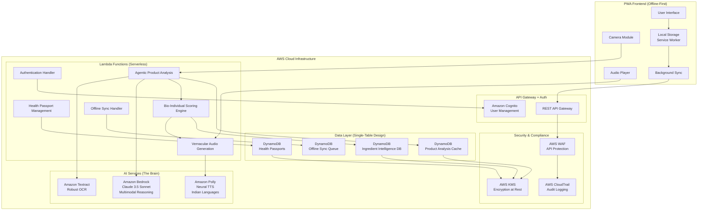
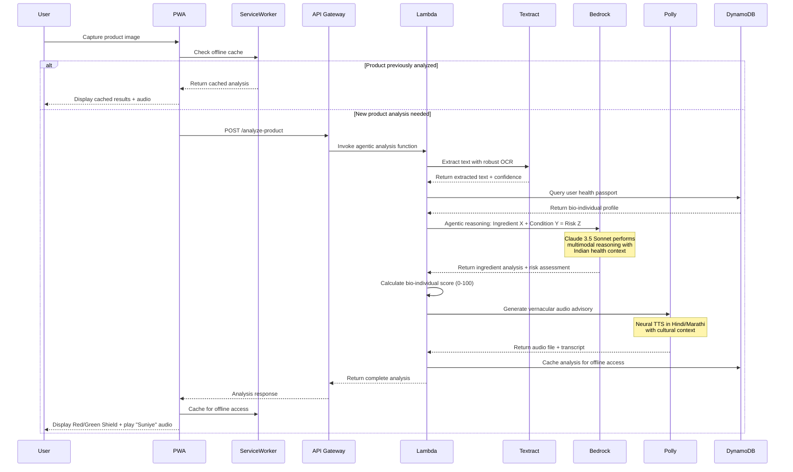
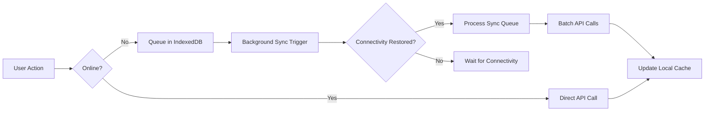

# Design Document: Swaasthya Sathi

## Overview

Swaasthya Sathi is an "India-First" health intelligence platform implemented as a serverless, AI-powered Progressive Web Application (PWA) that provides personalized food and cosmetic safety analysis for Indian consumers. The system leverages Amazon Bedrock's Claude 3.5 Sonnet for agentic multimodal ingredient analysis, Amazon Textract for robust OCR capabilities, and Amazon Polly for vernacular audio feedback through the "Suniye" feature.

The architecture follows a privacy-first, offline-first serverless design using AWS Lambda for compute, DynamoDB for data persistence, and implements bio-individual scoring that adapts safety recommendations based on user health profiles. The platform addresses the critical gap between generic health advice and personalized health intelligence, recognizing that health recommendations must be contextual to individual health conditions.

## Architecture

### High-Level Architecture



### Agentic Multimodal Analysis Flow



## Components and Interfaces

### 1. Progressive Web Application (PWA) Layer

**Frontend Architecture**
- Technology Stack: React/Next.js with TypeScript for type safety
- PWA Features: Service Worker for offline functionality, Web App Manifest for native-like experience
- Responsive Design: Mobile-first approach optimized for Indian smartphone market
- Offline-First Strategy: Critical functionality available without internet connectivity

**Camera Integration**
- Native camera APIs with image preprocessing for optimal OCR results
- Image quality validation and enhancement before processing
- Support for various lighting conditions common in Indian retail environments
- Fallback manual input for accessibility and edge cases

**Local Storage Strategy**
- IndexedDB for structured data (health passports, analysis cache)
- Service Worker cache for static assets and API responses
- Encrypted local storage for sensitive health information
- Background sync for seamless online/offline transitions

### 2. API Gateway Layer

**REST API Endpoints**
```
POST /api/v1/analyze-product
GET /api/v1/user/profile
PUT /api/v1/user/profile
POST /api/v1/user/register
GET /api/v1/product/{productId}
POST /api/v1/audio/generate
```

**Authentication & Authorization**
- JWT tokens via Amazon Cognito
- Rate limiting and request validation
- CORS configuration for mobile app access

### 3. Lambda Function Components

**Agentic Product Analysis Function**
- Input: Image data, user health passport ID
- Processing: Orchestrates Textract OCR → Bedrock reasoning → Bio-individual scoring
- AI Integration: Uses LangChain for RAG-based ingredient analysis with Indian health context
- Output: Comprehensive analysis with personalized risk assessment and recommendations
- Timeout: 30 seconds with progressive response for user feedback
- Memory: 2048 MB for handling large images and complex AI reasoning

**Bio-Individual Scoring Engine**
- Input: Parsed ingredients, user health passport, product category
- Processing: Multi-dimensional health impact calculation using Bedrock's reasoning capabilities
- Scoring Logic: Dynamic 0-100 scale with condition-specific penalties and bonuses
- Output: Numerical score with detailed explanations and Red/Green Shield categorization
- Integration: Real-time scoring with intelligent caching for performance optimization

**Vernacular Audio Advisory Generator ("Suniye" Feature)**
- Input: Analysis results, user language preference, cultural context
- Processing: Culturally-aware text generation → Amazon Polly neural TTS
- Languages: Hindi (Kajal voice), English-Indian (Raveena voice), Marathi (extensible)
- Output: High-quality audio files with synchronized transcripts
- Optimization: Compressed audio formats for mobile bandwidth efficiency

### 4. AI Services Integration

**Amazon Textract Integration (Robust OCR)**
- Service: Document text detection and analysis APIs
- Configuration: Optimized for curved, shiny, and crinkled product packaging
- Enhancement: Custom preprocessing for Indian product packaging characteristics
- Error Handling: Confidence scoring with intelligent fallback to manual input
- Performance: Sub-3 second processing for typical product images with retry logic

**Amazon Bedrock Integration (The Brain)**
- Model: Claude 3.5 Sonnet (multimodal reasoning capabilities)
- Prompt Engineering: Specialized prompts for Indian dietary patterns, health conditions, and cultural context
- RAG Implementation: LangChain integration with comprehensive ingredient knowledge base
- Context Awareness: Bio-individual health profiles, Indian food regulations (FSSAI), cultural dietary preferences
- Output: Structured JSON with ingredient classifications, health impacts, and personalized recommendations

**Amazon Polly Integration (Vernacular Voice)**
- Neural Voices: Kajal (Hindi), Raveena (English-Indian), with plans for regional language expansion
- SSML Features: Emphasis, pronunciation guides for complex ingredient names, cultural intonation
- Output Optimization: MP3 format with adaptive bitrate for varying network conditions
- Caching Strategy: Intelligent audio caching based on user language preferences and common queries

## Data Models

### User Health Passport (Bio-Individual Profile)
```json
{
  "userId": "string (UUID)",
  "passportVersion": "string (semantic versioning)",
  "personalInfo": {
    "ageGroup": "child|teen|adult|senior",
    "gender": "male|female|other|prefer_not_to_say",
    "region": "north|south|east|west|central_india"
  },
  "healthConditions": [
    {
      "condition": "diabetes|hypertension|pcod|heart_health|kidney_disease|thyroid",
      "type": "type1_diabetes|type2_diabetes|gestational_diabetes|primary_hypertension|secondary_hypertension",
      "severity": "mild|moderate|severe",
      "diagnosedDate": "ISO8601 date",
      "medications": ["string"],
      "restrictions": {
        "maxSodium": "number (mg/day)",
        "maxSugar": "number (g/day)",
        "avoidIngredients": ["string"]
      }
    }
  ],
  "allergies": [
    {
      "allergen": "gluten|lactose|nuts|shellfish|soy|eggs|custom",
      "customAllergen": "string (if allergen is custom)",
      "severity": "mild|moderate|severe|anaphylactic",
      "symptoms": ["string"],
      "dateIdentified": "ISO8601 date",
      "crossReactivities": ["string"]
    }
  ],
  "dietaryPreferences": {
    "type": "vegetarian|vegan|jain|halal|kosher|none",
    "restrictions": ["string"],
    "culturalDiet": "gujarati|punjabi|south_indian|bengali|maharashtrian|other"
  },
  "preferences": {
    "primaryLanguage": "hindi|english|marathi|tamil|telugu|gujarati|bengali",
    "audioEnabled": "boolean",
    "voiceSpeed": "slow|normal|fast",
    "riskTolerance": "very_low|low|medium|high",
    "notificationPreferences": {
      "urgentWarnings": "boolean",
      "dailyTips": "boolean",
      "weeklyReports": "boolean"
    }
  },
  "createdAt": "ISO8601 timestamp",
  "updatedAt": "ISO8601 timestamp",
  "lastSyncAt": "ISO8601 timestamp",
  "isActive": "boolean"
}
```

### Agentic Product Analysis Result
```json
{
  "analysisId": "string (UUID)",
  "userId": "string (UUID)",
  "analysisVersion": "string (semantic versioning)",
  "productInfo": {
    "name": "string",
    "brand": "string",
    "category": "food|cosmetic|supplement",
    "subCategory": "snacks|beverages|skincare|haircare|nutrition",
    "barcode": "string (optional)",
    "imageMetadata": {
      "captureTimestamp": "ISO8601 timestamp",
      "imageQuality": "high|medium|low",
      "ocrConfidence": "number (0-1)"
    }
  },
  "extractedData": {
    "rawText": "string",
    "structuredIngredients": "string",
    "nutritionalInfo": {
      "calories": "number (per 100g)",
      "sodium": "number (mg per 100g)",
      "sugar": "number (g per 100g)",
      "protein": "number (g per 100g)",
      "fat": "number (g per 100g)"
    }
  },
  "ingredientAnalysis": [
    {
      "name": "string",
      "quantity": "string (optional)",
      "position": "number (order in ingredient list)",
      "identifiers": {
        "eCode": "string (optional)",
        "casNumber": "string (optional)",
        "commonNames": ["string"],
        "scientificName": "string (optional)"
      },
      "classification": {
        "category": "preservative|sweetener|colorant|flavor|emulsifier|thickener|antioxidant",
        "naturalness": "natural|synthetic|semi_synthetic",
        "processingLevel": "minimal|moderate|highly_processed"
      },
      "healthImpact": {
        "overallRisk": "safe|low|moderate|high|severe",
        "specificRisks": {
          "diabetes": {
            "impact": "positive|neutral|negative",
            "severity": "low|medium|high",
            "mechanism": "string",
            "evidence": "string"
          },
          "hypertension": {
            "impact": "positive|neutral|negative",
            "severity": "low|medium|high",
            "mechanism": "string",
            "evidence": "string"
          },
          "allergies": {
            "isAllergen": "boolean",
            "allergenType": "string",
            "crossReactivity": ["string"]
          }
        },
        "regulatoryStatus": {
          "fssai": "approved|restricted|banned|under_review",
          "fda": "approved|restricted|banned|under_review",
          "eu": "approved|restricted|banned|under_review"
        }
      }
    }
  ],
  "bioIndividualAssessment": {
    "overallScore": "number (0-100)",
    "riskLevel": "safe|moderate_risk|high_risk",
    "shieldColor": "green|yellow|red",
    "scoreBreakdown": {
      "baseScore": "number (0-100)",
      "healthConditionAdjustments": {
        "diabetes": "number (-50 to +10)",
        "hypertension": "number (-50 to +10)",
        "allergies": "number (-100 to 0)"
      },
      "culturalDietaryFit": "number (-10 to +10)"
    },
    "personalizedExplanation": {
      "whySafe": ["string"],
      "whyRisky": ["string"],
      "specificConcerns": ["string"],
      "positiveAspects": ["string"]
    }
  },
  "recommendations": {
    "verdict": "safe_to_consume|consume_with_caution|avoid_completely",
    "actionableAdvice": ["string"],
    "alternatives": [
      {
        "productName": "string",
        "brand": "string",
        "reason": "string",
        "availability": "widely_available|limited|online_only"
      }
    ],
    "consultationAdvice": {
      "recommendConsultation": "boolean",
      "urgency": "immediate|within_week|routine_checkup",
      "reason": "string"
    }
  },
  "audioAdvisory": {
    "language": "string",
    "audioUrl": "string (temporary URL)",
    "transcript": "string",
    "duration": "number (seconds)",
    "voiceProfile": "string",
    "culturalContext": {
      "greetingStyle": "formal|informal|regional",
      "culturalReferences": ["string"],
      "localTerminology": ["string"]
    }
  },
  "metadata": {
    "processingTime": "number (milliseconds)",
    "aiModelVersions": {
      "textract": "string",
      "bedrock": "string",
      "polly": "string"
    },
    "confidenceScores": {
      "ocrAccuracy": "number (0-1)",
      "ingredientIdentification": "number (0-1)",
      "healthAssessment": "number (0-1)"
    }
  },
  "createdAt": "ISO8601 timestamp",
  "expiresAt": "ISO8601 timestamp (TTL for caching)",
  "offlineAvailable": "boolean"
}
```

### Ingredient Database Entry
```json
{
  "ingredientId": "string",
  "names": {
    "common": "string",
    "scientific": "string",
    "eCode": "string (optional)",
    "aliases": ["string"]
  },
  "healthImpacts": {
    "diabetes": {
      "impact": "positive|neutral|negative",
      "severity": "low|medium|high",
      "explanation": "string"
    },
    "hypertension": {
      "impact": "positive|neutral|negative",
      "severity": "low|medium|high",
      "explanation": "string"
    },
    "allergies": {
      "commonAllergens": ["string"],
      "crossReactivity": ["string"]
    }
  },
  "category": "preservative|sweetener|colorant|flavor|emulsifier",
  "regulatoryStatus": {
    "fssai": "approved|restricted|banned",
    "fda": "approved|restricted|banned"
  },
  "sources": ["string"],
  "lastUpdated": "ISO8601 timestamp"
}
```

### DynamoDB Single-Table Design Schema

**Table Name**: `swaasthya-sathi-main`
**Partition Key**: `PK` (string)
**Sort Key**: `SK` (string)
**Global Secondary Indexes**: 
- `GSI1`: `GSI1PK` (string), `GSI1SK` (string)
- `GSI2`: `GSI2PK` (string), `GSI2SK` (string)

**Access Patterns and Key Design**:

```json
{
  "UserHealthPassport": {
    "PK": "USER#{userId}",
    "SK": "PASSPORT#CURRENT",
    "GSI1PK": "PASSPORT#{userId}",
    "GSI1SK": "VERSION#{version}",
    "entityType": "health_passport",
    "data": "UserHealthPassport JSON"
  },
  "ProductAnalysis": {
    "PK": "USER#{userId}",
    "SK": "ANALYSIS#{analysisId}",
    "GSI1PK": "PRODUCT#{productHash}",
    "GSI1SK": "ANALYSIS#{timestamp}",
    "GSI2PK": "CATEGORY#{category}",
    "GSI2SK": "SCORE#{score}#{timestamp}",
    "entityType": "product_analysis",
    "data": "ProductAnalysisResult JSON",
    "ttl": "unix_timestamp"
  },
  "IngredientDatabase": {
    "PK": "INGREDIENT#{ingredientId}",
    "SK": "METADATA#CURRENT",
    "GSI1PK": "CATEGORY#{category}",
    "GSI1SK": "INGREDIENT#{name}",
    "GSI2PK": "ECODE#{eCode}",
    "GSI2SK": "INGREDIENT#{ingredientId}",
    "entityType": "ingredient_data",
    "data": "IngredientDatabaseEntry JSON"
  },
  "OfflineSyncQueue": {
    "PK": "USER#{userId}",
    "SK": "SYNC#{timestamp}#{actionType}",
    "GSI1PK": "SYNC#PENDING",
    "GSI1SK": "TIMESTAMP#{timestamp}",
    "entityType": "sync_item",
    "actionType": "create|update|delete",
    "resourceType": "passport|analysis",
    "data": "JSON payload",
    "status": "pending|processing|completed|failed",
    "retryCount": "number",
    "ttl": "unix_timestamp"
  }
}
```

### Offline Sync Architecture

**Offline-First Strategy**:
- All user data stored locally in IndexedDB with encryption
- Service Worker intercepts API calls and serves cached data when offline
- Background sync queues operations for when connectivity returns
- Conflict resolution using last-write-wins with user notification for critical conflicts

**Sync Queue Processing**:


## Correctness Properties

*A property is a characteristic or behavior that should hold true across all valid executions of a system—essentially, a formal statement about what the system should do. Properties serve as the bridge between human-readable specifications and machine-verifiable correctness guarantees.*

Let me analyze the acceptance criteria to determine which ones are testable as properties:

### Property 1: Bio-Individual Scoring Consistency
*For any* ingredient list and user health profile, the calculated Bio_Individual_Score should always be between 0 and 100, and users with allergies should receive a score of 0 for products containing their allergens
**Validates: Requirements 3.1, 3.4**

### Property 2: Health-Specific Scoring Logic
*For any* product analysis, users with diabetes should receive lower scores for high-glycemic ingredients, and users with hypertension should receive lower scores for high-sodium ingredients compared to users without these conditions
**Validates: Requirements 3.2, 3.3, 3.5**

### Property 3: OCR Text Extraction Reliability
*For any* product packaging image with visible text, the Vision_Engine should extract readable text or provide appropriate error handling when extraction fails
**Validates: Requirements 2.1, 2.4**

### Property 4: Ingredient Parsing Completeness
*For any* extracted text containing ingredient lists, the system should identify and parse individual ingredients with their quantities when available
**Validates: Requirements 2.2, 2.3**

### Property 5: Hidden Ingredient Detection
*For any* ingredient list, the system should correctly identify and decode E-codes, hidden sugars (like Maltodextrin), and endocrine disruptors (like Parabens) to their common names and health implications
**Validates: Requirements 4.1, 4.2, 4.3, 4.4**

### Property 6: Personalized Audio Generation
*For any* completed product analysis, the Audio_Advisory should generate spoken summaries in the user's selected language, with urgent warnings for high-risk ingredients
**Validates: Requirements 5.1, 5.3**

### Property 7: Safety Level Categorization
*For any* Bio_Individual_Score, the system should correctly categorize it as Safe (80-100), Moderate Risk (50-79), or High Risk (0-49) and provide appropriate explanations and recommendations
**Validates: Requirements 6.1, 6.2, 6.4, 6.5**

### Property 8: Data Encryption and Privacy
*For any* user health profile data, the system should encrypt the data both in transit and at rest, and should not permanently store product images after processing
**Validates: Requirements 7.1, 7.4**

### Property 9: Profile Update Propagation
*For any* user health profile update, all previously analyzed product scores should be recalculated to reflect the new health profile
**Validates: Requirements 1.4**

### Property 10: Performance Response Time
*For any* product analysis request under normal network conditions, the system should provide results within 10 seconds
**Validates: Requirements 8.1**

### Property 11: Error Handling and Recovery
*For any* system error condition, the system should provide clear error messages and recovery options to the user
**Validates: Requirements 8.4**

### Property 12: Database Update Propagation
*For any* ingredient database update, new ingredient information should be immediately available for analysis without requiring app updates
**Validates: Requirements 9.2, 9.4**

### Property 13: Multi-Category Product Support
*For any* product image, the system should correctly process both food and cosmetic products and provide appropriate analysis for each category
**Validates: Requirements 2.5**

### Property 14: User Interface Accessibility
*For any* analysis result display, the system should use both visual indicators (colors, icons) and text to accommodate users with different abilities
**Validates: Requirements 10.3**

### Property 15: Data Deletion Completeness
*For any* user data deletion request, the system should completely remove the user's health profile and all associated analysis data
**Validates: Requirements 7.5**

## Error Handling

### Agentic OCR Processing Errors
- **Image Quality Issues**: When Textract cannot extract readable text, the system uses Bedrock to analyze the image quality and provide specific guidance (e.g., "Please ensure better lighting" or "Hold camera steady")
- **Partial Text Extraction**: When ingredient lists are incomplete, the system combines OCR results with user input and uses Bedrock to validate completeness
- **Processing Timeouts**: If OCR processing exceeds timeout limits, the system provides progressive feedback and intelligent fallback options
- **Curved/Shiny Surface Challenges**: Specialized preprocessing algorithms for Indian packaging characteristics with retry mechanisms

### AI Analysis and Reasoning Errors
- **Bedrock Service Unavailability**: Implement exponential backoff retry logic with circuit breaker pattern and graceful degradation to cached analysis
- **Invalid Ingredient Recognition**: When Claude cannot identify ingredients, the system flags them for manual review and provides conservative safety warnings
- **Context Length Limits**: For very long ingredient lists, implement intelligent chunking strategy with context preservation across chunks
- **Hallucination Detection**: Cross-validation of AI responses against ingredient database with confidence scoring

### Bio-Individual Scoring Errors
- **Profile Inconsistencies**: When health passport data conflicts, the system prioritizes user safety with conservative scoring
- **Score Calculation Errors**: Validate all scores are within 0-100 range with detailed audit trails for debugging
- **Missing Health Context**: Default to general population safety guidelines when specific health condition data is unavailable
- **Cultural Context Misalignment**: Fallback to broader Indian dietary guidelines when specific regional data is missing

### Offline and Connectivity Errors
- **Sync Conflicts**: Implement intelligent conflict resolution with user notification for critical health data changes
- **Storage Quota Exceeded**: Intelligent cache management with priority-based data retention (health passport > recent analyses > older cache)
- **Background Sync Failures**: Retry mechanisms with exponential backoff and user notification for persistent failures
- **Partial Sync States**: Ensure data consistency during interrupted sync operations with transaction-like behavior

### Audio Generation and Playback Errors
- **Polly Service Failures**: Provide text-based fallbacks with option to retry audio generation when service is restored
- **Language Support Issues**: Graceful fallback to English when requested regional language is unavailable, with user notification
- **Audio Playback Errors**: Multiple audio format support with progressive enhancement based on device capabilities
- **Cultural Context Errors**: Fallback to standard terminology when cultural localization fails

## Testing Strategy

### Dual Testing Approach

The testing strategy employs both unit testing and property-based testing to ensure comprehensive coverage:

**Unit Tests** focus on:
- Specific examples of ingredient parsing and scoring
- Integration points between AWS services
- Edge cases like empty ingredient lists or malformed data
- Error conditions and recovery scenarios
- UI component behavior and accessibility features

**Property-Based Tests** focus on:
- Universal properties that hold across all inputs
- Comprehensive input coverage through randomization
- Validation of correctness properties defined in this design

### Property-Based Testing Configuration

**Testing Framework**: Use Hypothesis (Python) or fast-check (TypeScript/JavaScript) for property-based testing
**Test Configuration**: Minimum 100 iterations per property test to ensure statistical confidence
**Test Tagging**: Each property test must include a comment referencing its design document property

Tag format: **Feature: swaasthya-sathi, Property {number}: {property_text}**

### Testing Implementation Requirements

**Property Test Implementation**:
- Each correctness property must be implemented by exactly one property-based test
- Property tests should generate diverse, realistic test data including various ingredient combinations, health profiles representing Indian user personas, and product types common in Indian markets
- Tests must validate both positive and negative cases (valid inputs produce expected outputs, invalid inputs are handled gracefully)
- Generate test data that reflects Indian dietary patterns, common health conditions, and cultural preferences

**Unit Test Balance**:
- Avoid excessive unit tests - property-based tests handle comprehensive input coverage
- Focus unit tests on specific integration scenarios with AWS services, concrete examples of Indian products, and edge cases specific to Indian market conditions
- Ensure unit tests complement rather than duplicate property test coverage
- Test offline-first PWA functionality and sync mechanisms

**Integration Testing**:
- Test end-to-end workflows from image capture to vernacular audio advisory generation
- Validate AWS service integrations with mock services for consistent testing
- Test offline capabilities and network failure scenarios common in Tier-3 cities
- Validate cultural and linguistic accuracy of audio advisories

**Performance Testing**:
- Load testing for concurrent user scenarios during peak shopping hours
- Response time validation under various Indian network conditions (2G, 3G, 4G, WiFi)
- Memory and resource usage testing for budget Android devices popular in India
- Offline storage efficiency and sync performance testing

**Security and Privacy Testing**:
- Encryption validation for health passport data at rest and in transit
- Authentication and authorization testing with Amazon Cognito
- Privacy compliance validation for Indian health data regulations
- Test data deletion completeness and user consent mechanisms

**Cultural and Accessibility Testing**:
- Validate vernacular audio quality and cultural appropriateness
- Test accessibility features with screen readers and high contrast modes
- Validate UI/UX for users with varying technical literacy levels
- Test multi-language support accuracy and cultural context

### Test Data Management

**Synthetic Data Generation**:
- Generate realistic product images representing popular Indian brands and packaging styles
- Create diverse ingredient lists covering common Indian food additives, preservatives, and traditional ingredients
- Generate health profiles representing target user personas (diabetic seniors, PCOD-affected women, hypertensive professionals)
- Include cultural dietary patterns (vegetarian, Jain, regional preferences) in test data

**Test Environment**:
- Use AWS LocalStack for local development testing with full service simulation
- Implement CI/CD pipeline with automated testing on AWS test environment
- Maintain separate test databases with known ingredient data validated against FSSAI guidelines
- Test offline-first functionality with network simulation tools

**Compliance and Regulatory Testing**:
- Validate FSSAI and FDA regulatory data accuracy with official databases
- Test privacy controls and data deletion capabilities per Indian data protection requirements
- Ensure accessibility compliance with WCAG guidelines and Indian accessibility standards
- Validate cultural sensitivity and linguistic accuracy of content

**Real-World Testing**:
- Beta testing with actual Indian users across different demographics and regions
- Test with real product images from Indian supermarkets and local stores
- Validate audio quality and cultural appropriateness with native speakers
- Performance testing on popular Indian smartphone models and network conditions
